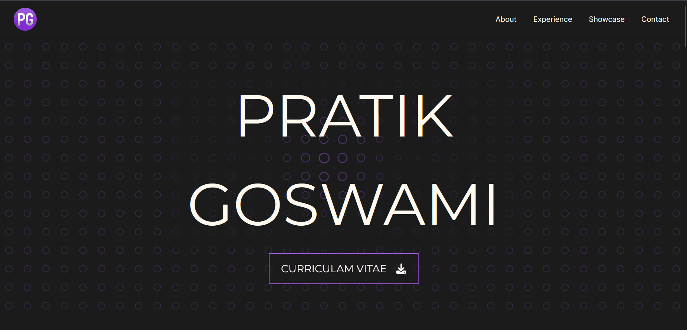

# Portfolio Website

<a href="https://pratikgoswami.vercel.app/">Live Website</a>

Welcome to the repository for my personal portfolio website! This website showcases my skills, projects, and experiences. Feel free to explore and learn more about me.

## About

This portfolio website serves as a digital representation of my professional profile. It includes sections such as:

- About Me: A brief introduction to who I am.
- Skills: An overview of my technical skills.
- Projects: Highlights of some key projects I have worked on.
- Experience: A brief highlight of my work experience.
- Contact: How to get in touch with me.

## Features

- Responsive Design: Ensures a seamless experience across various devices.
- Project Showcasing: Highlights my skills and projects effectively.
- Animated Components: A reactive background to captivate the viewer

## Technologies Used

- HTML5
- CSS3
- TypeScript
- Next.js
- TSParticles
- Sanity CMS
- Google Analytics
- Vercel
